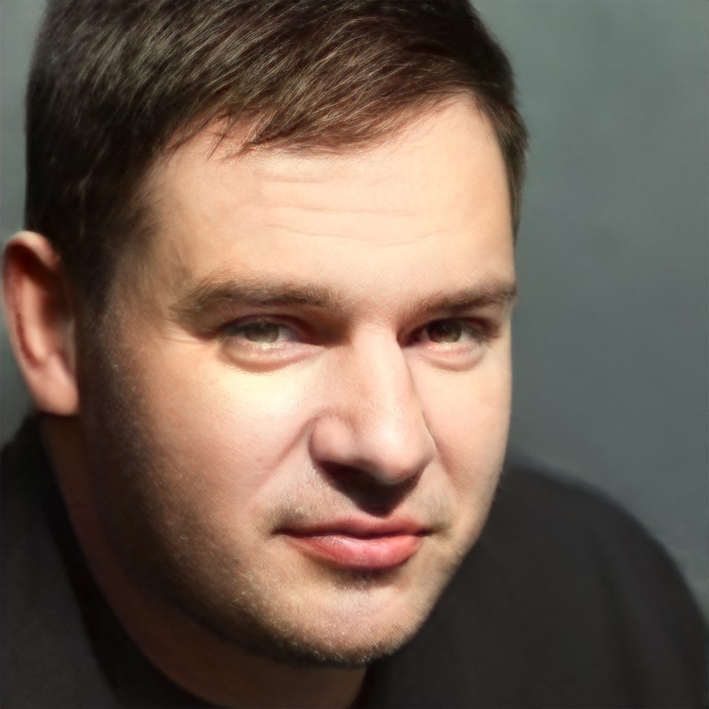

Authors:
- Kajetan Kubik
- Bartosz Maślanka

Important Colabs Notebooks:
- [Style Transfer](https://colab.research.google.com/drive/1eSayvcQOY80RUIGCsGpD0pVxwtMF7KOH?usp=sharing)
- [Model Blending](https://colab.research.google.com/drive/1ae7LhhPscu4AKqgXY3c9P69urqmLIlLj?usp=sharing)

# Style Transfer

Family of AI algorithms that refers to manipulating images. In short, the main goal is to transfer the style of one image into another. My favorite website to do this is [DeepDream](https://deepdreamgenerator.com/). 
 
Traditional methods rely on manipulating image in such a way that
the sum of losses(differences) between: (target image, original image) and (target image, style image) was the lowest. To do this most often pretrained VGG19 (Neural Network model) is used, along with mathematical tools like Gram matrix.

  
  
   
   
   

# Style Transfer via StyleGAN2

StyleGAN is a type of GAN. Article titled "A Style-Based Generator Architecture for Generative Adversarial Networks" was published by Nvidia in 2018. 

The paper proposes a new generator architecture for GAN that allows the control of different levels of detail in the generated samples from coarse details (e.g. head shape) to fine details (e.g. eye color).

One of the main ideas that distinguished this architecture among others was Progressive GAN. At the beginning the network is trained in low resolution (4x4), and next layers are added after getting satisfying results. Thanks to this, the training process is much more stable.

  *Progressive Growing GAN [Source: Sarah Wolf]*
 
Another thing is replacing traditional common latent code for each layer (W(1,\*)) with separate latnet code for each layer (W(18,\*)).

The possibilities of this model are incredible. Take for example StyleGan that generates art images. GAN (in general) was created to create new, in this case, art images. For each input ( vector of 18 x 512 ) random values it returns a new art. It means that for one input, output will always be the same. So what if we could control this input? If we, theoretically, transforme our image into this latent code, could we change ourselves into art? YES. We have to do a little trick: we have to try ‘quess’ latent code that would produce us (or more precisely: image similar to us) on a model that created Humans. That's it. We then can feed this code to models that create art. This is the effect. 

What is more, we can freely manipulate this latent code. We can change our hair style, facial expression, age or even sex. [Good example.](https://github.com/woctezuma/stylegan2-projecting-images)

But can we change our species? First, we have to create one.

# Blending Models

How is this process going? First we need to have two models that have the same config and same resolution. We copy weights from the first one, and after some chosen upscaling layer, we copy values from another.

Why bother? Beacuse if image does not reminds face, our method is useless.

# Examples of Blended Models

  
  
  
  

# Examples of Style Transfers 2.0

    
  
  

  
  
  

  
  
  

    
  
  

# Examples of 'normal' Style Transfers

  
  
   
   
   

  
  
   
   
   

# Future work

Technily speaking it was posibilty makes interlace or join 3 models:

Also, what if we reverse the process: we put art image; can we expected that we get "normal" picture? In this way, can we make dearting?

But what will be results? We don't know

# Summary

Most of our code is from this StyleGAN2 [repo](https://github.com/justinpinkney/stylegan2).

Our work is presented in Google Colabs presented at the begginig. 

We choose StyleGAN2, becuse across all (StyleGAN1, StyleGAN2, StyleGAN3), have the most pretrained models.

We don't have any dataset or metrics, because we do not train any model. Number of parameters of this model dependence from subtype (config) of him, but it is atleast over 30 mln.
Pickle file for each model weight over 300 MB. 

Only hyperparameter thet we use, it is layer after which we make switch, and we choose the one with most satysfing results.

## Models

We used StyleGAN2 and all models in this project are some variant of this models.
In total we used something like 5 diffrent pretrain gans, and we created countless models due to blending models, however only few of them are what's so over visualy satysfing. In notebooks we give links to 6 of them. 

## Used tools

- MlFlow(only for saving parameters for runs)
- Tensorboard (only to generete graph):

- RestAPI:

- Docker(it should work, but for some reasone it doesn't):

## Links

https://github.com/justinpinkney/awesome-pretrained-stylegan2

https://github.com/justinpinkney/stylegan2

https://www.ecva.net/papers/eccv_2020/papers_ECCV/papers/123670171.pdf

https://medium.com/swlh/hairstyle-transfer-semantic-editing-gan-latent-code-b3a6ccf91e82

https://towardsdatascience.com/style-transfer-with-gans-on-hd-images-88e8efcf3716

https://github.com/maciej3031/comixify

https://github.com/akanimax/msg-stylegan-tf

https://github.com/justinpinkney/toonify/blob/master/toonify-yourself.ipynb -->

https://github.com/matthias-wright/flaxmodels

https://github.com/matthias-wright/flaxmodels/blob/main/flaxmodels/stylegan2/stylegan2_demo.ipynb

https://openaccess.thecvf.com/content_ICCV_2019/papers/Abdal_Image2StyleGAN_How_to_Embed_Images_Into_the_StyleGAN_Latent_Space_ICCV_2019_paper.pdf

